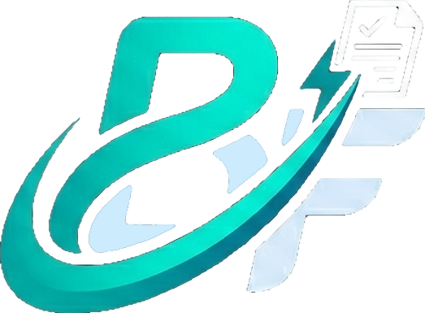

# BrioFE — Programma di Fatturazione Elettronica



> Genera fatture elettroniche XML conformi al formato SDI FPR12 v1.2.3 dell'Agenzia delle Entrate italiana — direttamente nel browser, senza installazioni, senza server, senza memorizzazione di dati.

[](CHANGELOG.md)
[](LICENSE)
[](https://www.fatturapa.gov.it)
[](https://developer.mozilla.org/en-US/docs/Web/HTML)

---

## ✨ Funzionalità (v0.03 alpha)

- 📋 **Compilazione guidata** di tutti i campi della fattura ordinaria (FPR12 v1.2.3)
- 🧮 **Calcolo automatico** di imponibili, IVA, totali e riepilogo aliquote in tempo reale
- 📥 **Generazione e download** del file XML `IT[PIVA]_[progressivo].xml`
- 🔢 **Progressivo Invio automatico** formato BrioFE (`BF` + anno + lettera + 2 cifre) — es. `BF26B21`
- ☑ **Bollo virtuale automatico**: rilevamento dell'obbligo di bollo per Natura N1/N2.1/N2.2/N3.5/N3.6/N4/N6.x con importo > €77,47
- 🗂 **Menu di navigazione rapida** laterale: persistente su desktop, overlay su mobile
- ✅ **Validazione** dei campi obbligatori prima della generazione
- 🔐 **Privacy by design**: nessun dato viene salvato o trasmesso
- 📱 **Responsive**: funziona su desktop, tablet e mobile
- 📂 **Importazione XML completa**: carica una fattura FPR12 esistente nel form (tutti i campi supportati)
- 👤 **Importazione cedente/cliente da XML**: importa selettivamente i dati anagrafici senza toccare le righe
- 🆓 **Zero dipendenze server**: funziona aprendo direttamente il file HTML

---

## 🚀 Come iniziare

### Utilizzo rapido (senza server)

1. **Scarica o clona** il repository:
   ```bash
   git clone https://github.com/denvermotel/BrioFE.git
   ```

2. **Apri** il file `index.html` nel browser:
   - Windows: doppio click su `index.html`
   - Mac/Linux: `open index.html` nel terminale
   - Oppure trascina il file nel browser

3. **Compila** il modulo con i dati del cedente, cliente e righe fattura

4. Clicca su **"Genera XML"** per scaricare il file pronto per il SDI

### Con server locale (consigliato per sviluppo)

```bash
# Python 3
python -m http.server 8080

# Node.js (con npx)
npx serve .

# PHP
php -S localhost:8080
```

Poi apri `http://localhost:8080` nel browser.

---

## 📁 Struttura del Progetto

```
BrioFE/
├── index.html              # Applicazione principale
├── info.html               # Pagina di presentazione del progetto
├── visualizzatore.html     # Visualizzatore fatture XML (placeholder)
├── LICENSE                 # Licenza GPL-3.0
├── README.md               # Questo file
├── CHANGELOG.md            # Storico delle modifiche
├── img/
│   └── logo.png     # Logo BrioFE
└── asset/
    ├── style.css           # Foglio di stile principale
    └── app.js              # Logica applicativa (generazione XML)
```

---

## 📄 Formato XML generato

BrioFE genera file XML conformi alle specifiche:
- **Formato**: `FPR12` (Fattura verso Privati, B2B e verso PA con formato ordinario)
- **Standard**: Schema XSD `v1.2.3` — `http://ivaservizi.agenziaentrate.gov.it/docs/xsd/fatture/v1.2`
- **Nome file**: `IT[PARTITAIVA]_[PROGRESSIVO].xml` (es: `IT12345678901_BF26A01.xml`)
- **Encoding**: UTF-8

### Progressivo Invio BrioFE

Il progressivo è generato automaticamente con il formato proprietario a 7 caratteri:

```
BF + YY + L + NN
```

- `BF` — prefisso fisso BrioFE
- `YY` — anno della fattura (2 cifre, es. `26` per 2026)
- `L` — lettera calcolata dal numero fattura: A=0–99, B=100–199, C=200–299…
- `NN` — ultime 2 cifre del numero fattura

**Esempi:** fattura 1/2026 → `BF26A01` | fattura 121/2026 → `BF26B21` | fattura 250/2026 → `BF26C50`

---

## 📋 Tipi documento supportati

| Codice | Descrizione |
|--------|-------------|
| TD01 | Fattura ordinaria |
| TD04 | Nota di credito |
| TD05 | Nota di debito |
| TD24 | Fattura differita (art.21 c.4 lett. a) |
| TD25 | Fattura differita (art.21 c.4 lett. b) |
| TD26 | Cessione beni ammortizzabili |
| TD27 | Fattura autoconsumo/cessione gratuita |

---

## 🔢 Aliquote IVA e Natura

Aliquote supportate: **22%, 10%, 5%, 4%, 0%**

Per IVA 0%, selezionare il codice Natura:

| Codice | Descrizione | Bollo obbligatorio |
|--------|-------------|-------------------|
| N1 | Escluse ex art. 15 | ✓ se importo > €77,47 |
| N2.1 | Non soggette artt. 7–7-septies | ✓ se importo > €77,47 |
| N2.2 | Non soggette — altri casi | ✓ se importo > €77,47 |
| N3.1–N3.4 | Non imponibili (esportazioni, cessioni intra-UE, San Marino) | ✗ |
| N3.5 | Non imponibili — dichiarazioni d'intento | ✓ se importo > €77,47 |
| N3.6 | Non imponibili — altri casi | ✓ se importo > €77,47 |
| N4 | Esenti | ✓ se importo > €77,47 |
| N5 | Regime del margine | ✗ |
| N6.1–N6.9 | Inversione contabile (reverse charge) | ✓ se IVA=0 e importo > €77,47 |
| N7 | IVA assolta in altro stato UE | ✗ |

---

## 💳 Modalità di pagamento

Supportate: MP01 (contanti), MP05 (bonifico), MP08 (carta), MP12 (RIBA), MP19–MP21 (SEPA), MP23 (PagoPA) e altre.

---

## ⚠️ Limitazioni versione 0.03-alpha

- ❌ Non supporta fatture di **professionisti** con ritenuta d'acconto
- ❌ Non supporta la **cassa previdenziale** (es. INPS gestione separata)
- ❌ Non supporta la **fattura PA** (FPA12) con CIG/CUP
- ❌ Il **visualizzatore fatture XML e messaggi SDI** non è ancora disponibile (roadmap futura)
- ❌ La **generazione PDF** non è ancora disponibile (roadmap v0.05)
- ❌ Non gestisce **allegati** nella fattura

---

## 🗺️ Roadmap

Vedi [CHANGELOG.md](CHANGELOG.md) per i dettagli sulle versioni passate e future.

---

## 📜 Licenza

Distribuito sotto licenza **GPL-3.0**. Vedi [LICENSE](LICENSE) per i dettagli.

---

## ⚖️ Disclaimer

BrioFE è un software open source in fase di sviluppo alpha. **Non utilizzare i file generati per l'invio reale al Sistema di Interscambio (SDI).** Non costituisce consulenza fiscale o tributaria. Verificare sempre la conformità dei documenti generati con la normativa vigente prima della trasmissione. Gli autori non sono responsabili per eventuali errori o utilizzi impropri.

---

## 🔗 Link utili

- [Sito del progetto](https://denvermotel.github.io/BrioFE/)
- [Repository GitHub](https://github.com/denvermotel/BrioFE)
- [Specifiche tecniche FPR12 — Agenzia delle Entrate](https://www.fatturapa.gov.it)
- [Portale Fatturazione Elettronica](https://ivaservizi.agenziaentrate.gov.it/portale/)
- [Schema XSD ufficiale FPR12 v1.2.3](https://www.fatturapa.gov.it/export/fatturazione/sdi/fatturapa/v1.2/)
- [Guida alla fatturazione elettronica](https://www.agenziaentrate.gov.it/portale/web/guest/fattura-elettronica)
